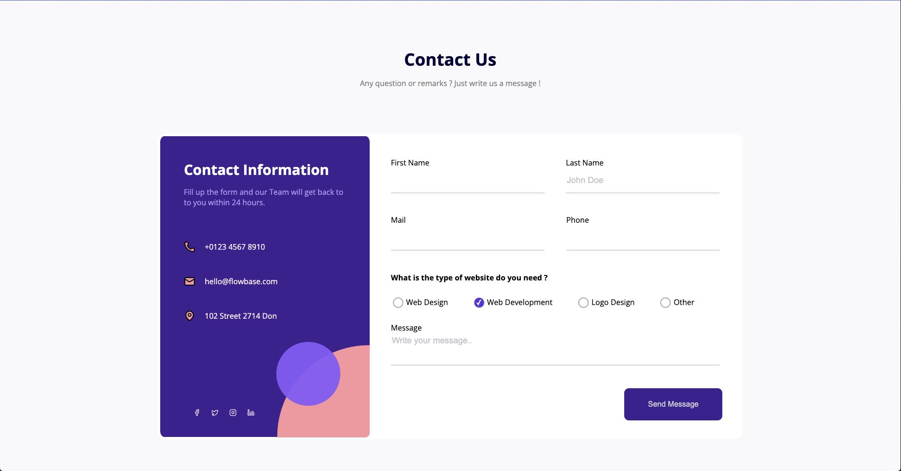

# 💬 Formify

**Formify** is a clean and responsive **Contact Us form** built entirely with **HTML5** and **CSS3** — no JavaScript.  
This project focuses on user experience and modern UI practices, providing a professional contact form layout for any website.

## 🖼️ Preview



## ✨ Features

- Clean and modern UI
- Fully responsive layout
- Interactive form fields with focus states
- User-friendly experience across devices
- CSS-only implementation (no JS)

## 🛠 Technologies Used

- 
- 

## 📦 Getting Started

To run this project locally:

```bash
git clone https://github.com/chealeanpenhchakrith/Formify.git
cd Formify
open index.html
